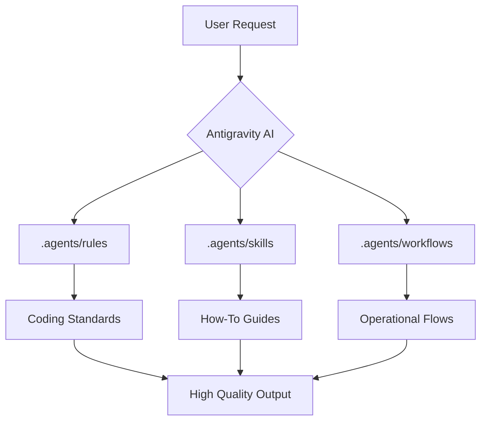

# Antigravity Skills & Rules Library

Welcome to the personal library of skills, rules, and agents for **Antigravity**. 
This repository is designed to centralize and standardize AI agent behavior, ensuring consistency, security, and high quality in software development.

---
🌍 **Language / Linguaggio**: English (Secondary) | **[Italiano (README.md)](./README.md)**  
📜 **Governance**: **[LICENSE](./LICENSE)** | **[CONTRIBUTING.md](./CONTRIBUTING.md)** | **Version**: `v3.3.0`
---

## 🛠️ Prerequisites & Installation

To fully leverage all Antigravity features (including structural awareness via Knowledge Graph), please ensure you have:
- **Node.js** (v16+)
- **Python** (v3.10+)

### Quick Setup
To automatically configure the virtual environment and Python dependencies:
```bash
# Sync (if in a new project) and inject scripts
node sync-library.js

# Run automatic setup (venv, graphify, hooks)
node scripts/setup-project.js
```

## 🏗️ System Architecture

The Antigravity ecosystem is built on three fundamental pillars that guide the agent throughout the entire development lifecycle:



## Repository Structure

- **`.agents/rules/`**: Coding rules and standards (e.g., common, language-specific like Python, TS).
- **`.agents/skills/`**: "How-To" modules for complex operations (e.g., TDD, Optimization, Security Audit).
- **`.agents/workflows/`**: Operational sequences, automated processes, and Personas (e.g., Architect, Code Reviewer).
- **`logTrace/`**: Session history and agent memory.

> [!IMPORTANT]
> All code changes must pass the automatic validation process (`npm run validate`) before being considered definitive.

---

## Philosophy
The goal is to create an ecosystem where AI is not just a chat, but a specialized tool guided by strict rules and specific skills.

👉 **[Read the Full Usage Guide](./howtouse.md)** and the **[Agent Instructions](./AGENT.md)** to learn how to integrate Antigravity into your daily workflow.

---

## 🚀 Quick Commands

To maintain library integrity, use the following commands:

```bash
# Validate library structure and links
npm run validate

# Regenerate the catalog in the README
npm run catalog

# Create a new Architectural Decision Record (ADR)
npm run adr "Title"

# Regenerate Knowledge Graph
npm run graph:build

# Query structural dependencies
npm run graph:query "Show dependencies for X"

# Execute the full release cycle (validate + catalog + tag)
npm run release
```

---

## 📊 Quality Pipeline

The repository implements continuous quality checks. The documentation evaluation script can be run manually:

```bash
# Evaluate a specific .md file
node scripts/evaluate-md-quality.js .agents/rules/common.md
```

> [!TIP]
> To achieve the maximum score (100/100), Markdown files must include YAML frontmatter, Mermaid diagrams, alert tags, and at least 3 code examples.

---

## How to Contribute
Please refer to the **[CONTRIBUTING.md](./CONTRIBUTING.md)** guide to add new rules or skills. Ensure you follow the existing templates and update the repository version in `package.json`.

---

## Reference Sections
- **[Italian Version (Main)](./README.md)**
- **[Usage Guide](./howtouse.md)**
- **[Agent Protocol](./AGENT.md)**
- **[License](./LICENSE)**

---
*v3.2.2 - Antigravity Core Protocol*
