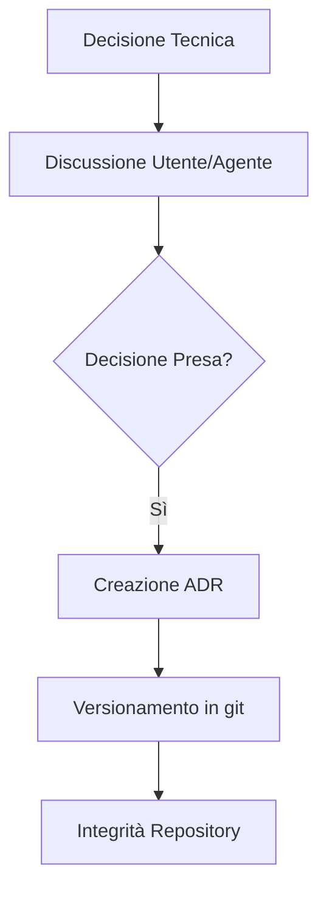

# ADR-0001: Adopting Architecture Decision Records

> [!IMPORTANT]
> Gli ADR sono la "storia vivente" dell'architettura del repository. Senza di essi, il debito tecnico cresce senza una spiegazione del perché sia nato.

## Contesto
La libreria Antigravity sta crescendo rapidamente in termini di regole, skill e agenti. Le decisioni tecniche (formati file, naming, standard di sicurezza) vengono prese iterativamente ma non sono documentate in modo centralizzato. Questo rende difficile per i nuovi utenti (o nuovi agenti) capire il *perché* di certe scelte.



## Opzioni Considerate
1.  **Documentazione inline**: Commenti nei file o README estesi.
2.  **Wiki esterna**: Poco pratica per il versioning insieme al codice.
3.  **ADR (Architecture Decision Records)**: Record testuali archiviati nel repository.

## Decisione
Scegliamo **ADR** perché sono leggeri, versionati insieme al codice e facilmente scansionabili dagli agenti AI. Verranno salvati in `docs/adr/`.

### Esempio di Naming ADR
```bash
# Esempio di creazione file
# docs/adr/[ID]-[titolo-in-kebab-case].md
touch docs/adr/0001-adopting-adr.md
```

## Conseguenze
### ✅ Positive
- Tracciabilità delle decisioni nel tempo.
- Onboarding facilitato per l'agente `@architect`.
- Separazione tra *regole* (cosa fare) e *decisioni* (perché lo facciamo).

### ❌ Negative / Trade-off
- Overload di documentazione se usato per decisioni triviali.

## Struttura Suggerita
```markdown
# ID: Titolo
**Status**: [Proposed | Accepted | Deprecated]
## Contesto
## Decisione
## Conseguenze
```

---
*v1.1 - Architectural Governance*
