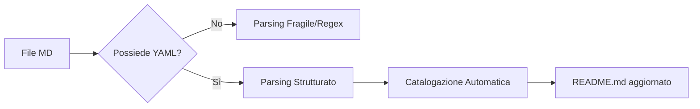

# ADR-0002: Standardizing Metadata with YAML Frontmatter

> [!NOTE]
> Lo YAML Frontmatter trasforma documenti statici in oggetti di dati interrogabili.

## Contesto
Gli asset della libreria (regole e skill) hanno bisogno di essere indicizzati, filtrati e cercati in modo programmatico (es. dallo script `generate-catalog.js`). Finora sono stati usati metodi fragili (regex sull'H1) per estrarre titoli e descrizioni.



## Opzioni Considerate
1.  **JSON Sidecar**: Un file .json per ogni .md (troppo verboso).
2.  **Regole di Naming Rigide**: Estrarre tutto dal nome file (troppo limitante).
3.  **YAML Frontmatter**: Standard industriale per metadati in Markdown.

## Decisione
Scegliamo **YAML Frontmatter** come blocco iniziale di ogni file Markdown in `.agents/rules/`, `.agents/skills/` e `.agents/workflows/`.

### Schema Standard:
```yaml
---
title: "Titolo Asset"
description: "Breve descrizione per il catalogo"
category: "Frontend | Backend | Security | AI | DevOps"
tags: ["node", "security", "workflow"]
---
```

## Conseguenze
### ✅ Positive
- Automazione robusta per la generazione del catalogo.
- Possibilità di creare un'interfaccia di ricerca avanzata in futuro.
- Documentazione più professionale e strutturata.

### ❌ Negative / Trade-off
- Necessità di aggiornare tutti i file esistenti.

## Esempio di Utilizzo
```markdown
---
title: "TDD Workflow"
description: "Guida al Red-Green-Refactor"
tags: [tdd, test, quality]
---
# TDD Workflow
...
```

---
*v1.1 - Metadata Governance*
