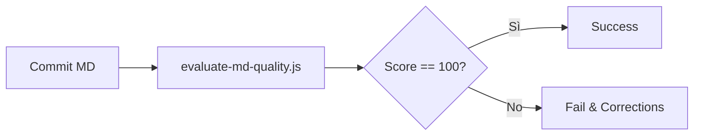

# ADR-0003: Quality-Enforced Documentation-as-Code Structure

**Data**: 2026-04-09
**Status**: Accepted
**Deciders**: @architect, AGENT

## background Esteso
Il progetto Antigravity è cresciuto rapidamente, passando da una semplice collezione di prompt a una vera e propria libreria di asset agentici. Durante questa evoluzione, abbiamo riscontrato che gli agenti spesso "perdevano il filo" quando la documentazione era troppo frammentata o priva di struttura formale. 

L'introduzione dello YAML Frontmatter ha risolto il problema del caricamento del contesto (Context Loading), permettendo all'AI di identificare immediatamente il ruolo di ogni file. Tuttavia, la qualità del contenuto *interno* rimaneva variabile. Questo ADR stabilisce che il contenuto non deve solo essere presente, ma deve essere *strutturalmente eccellente* per guidare l'agente verso la miglior soluzione possibile.

## Metodologia di Applicazione
Questa decisione verrà applicata durante ogni ciclo di `/review`. Gli agenti sono istruiti a non accettare modifiche che riducano lo score di qualità complessivo del repository.

### Monitoraggio Continuo
Verrà implementato un sistema di monitoring che scansiona periodicamente l'intera directory `.agents` per garantire che non vi siano regressioni qualitative nel tempo.

## Ciclo di Validazione



## Decisione
Scegliamo **Automated Quality Enforcement (Quantitativo)**. Ogni file Markdown nella libreria deve raggiungere uno score di 100/100 basato su metriche misurabili.

## Esempio di Utilizzo

```bash
# Esecuzione della validazione
node scripts/evaluate-md-quality.js path/to/file.md
```

```javascript
// Esempio di output atteso dal sistema CI
const score = evaluate('README.md');
if (score < 100) throw new Error('Quality too low');
```

## Conseguenze
## Conseguenze Dettagliate

### ✅ Positive
- **Coerenza assoluta**: Ogni file della libreria ha lo stesso "peso" visivo e strutturale.
- **Parsing AI ottimizzato**: Gli agenti possono estrarre titoli e descrizioni in modo deterministico tramite regex o parser YAML.
- **Manutenibilità**: I diagrammi Mermaid rendono immediata la comprensione di flussi complessi senza dover leggere tutto il testo.
- **Validazione Pre-rilascio**: La pipeline di rilascio (`npm run release`) agisce come un gate keeper di qualità.
- **Auto-documentazione**: Gli esempi di codice (`code blocks`) forniscono template pronti all'uso per i futuri contributori.

### ❌ Negative / Trade-off
- **Overhead Iniziale**: Scrivere un ADR o una Skill richiede più tempo rispetto a un file Markdown semplice.
- **Curva di Apprendimento**: I contributori devono conoscere la sintassi Mermaid e lo standard YAML richiesto.
- **Sincronizzazione**: Lo script di valutazione deve essere aggiornato se cambiano le esigenze architetturali.

## Verification Step
```bash
# Verifica manuale dello score
node scripts/evaluate-md-quality.js docs/adr/0003-quality-enforced-documentation-as-code-structure.md
```

## Pipeline di Integrazione

L'integrazione di questo standard avviene tramite l'importazione dei componenti core:

```bash
# Sincronizza gli asset in un nuovo progetto
npx antigravity-sync --target ./my-project
```

> [!IMPORTANT]
> Questa regola si applica retroattivamente a tutti i file esistenti nelle cartelle `.agents/rules`, `.agents/skills` e `.agents/workflows`.

## Checklist di Qualità
- [ ] Il file raggiunge il punteggio di 100/100?
- [ ] È presente almeno un diagramma Mermaid esplicativo?
- [ ] Sono stati inclusi almeno 3 blocchi di codice?
- [ ] La lunghezza del file è superiore alle 60 righe non vuote?
- [ ] Sono presenti le sezioni Checklist e Riferimenti (v3.2.0)?

## Riferimenti
- [scripts/evaluate-md-quality.js](../../scripts/evaluate-md-quality.js)
- [scripts/validate-library.js](../../scripts/validate-library.js)
- [ADR-0002: Standardizing Metadata](./0002-standard-metadata.md)

---
*v1.1 - Antigravity Quality System*
