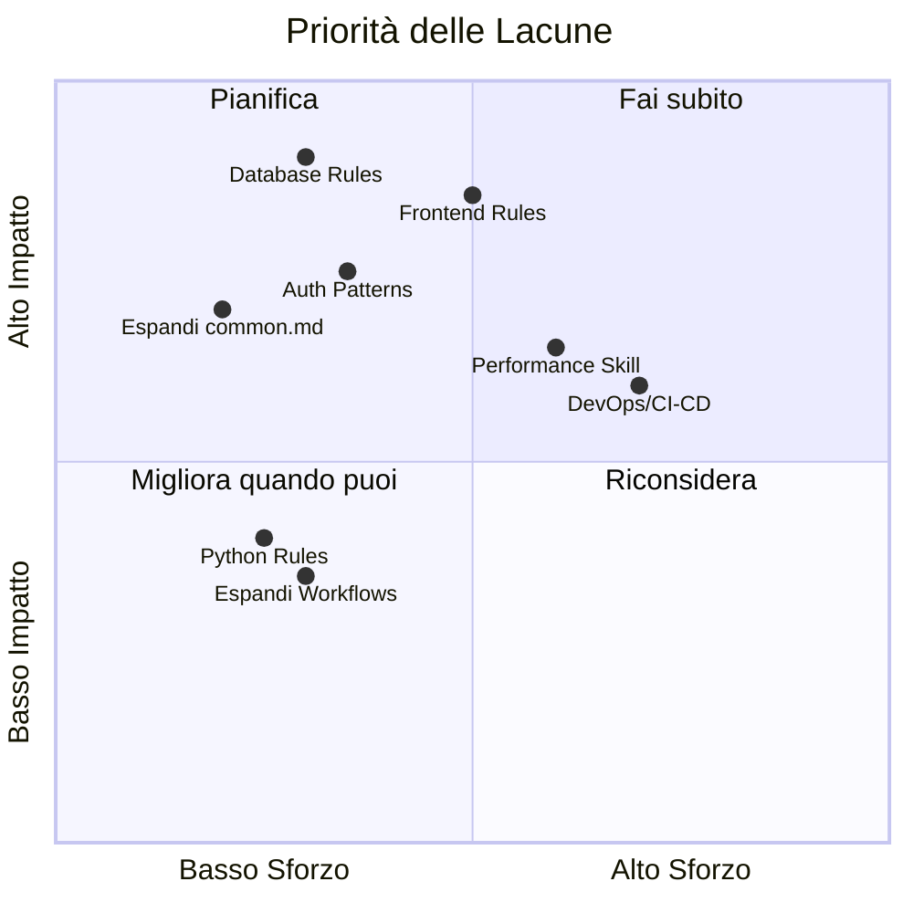

# 🔍 Review: Antigravity Skills & Rules Library

Analisi completa della libreria per valutare se è adatta a **tutti i tipi di applicazione** o se presenta lacune significative.

---

## ✅ Punti di Forza Attuali

| Area | Copertura | File |
|---|---|---|
| Clean Architecture | Solida | [common.md]({{WORKSPACE}}/docs/rules/common.md) |
| Sicurezza (OWASP) | Buona base | [security.md]({{WORKSPACE}}/docs/rules/security.md) |
| TDD | Ben strutturato | [tdd-workflow.md]({{WORKSPACE}}/skills/tdd-workflow.md) |
| API REST | Completo | [api-design.md]({{WORKSPACE}}/skills/api-design.md) |
| Debugging sistematico | Eccellente | [debugging-pro.md]({{WORKSPACE}}/skills/debugging-pro.md) |
| Refactoring (Fowler) | Buono | [refactoring-guide.md]({{WORKSPACE}}/skills/refactoring-guide.md) |
| Documentazione | Completo | [documentation-standards.md]({{WORKSPACE}}/skills/documentation-standards.md) |
| Continuous Learning | Innovativo | [continuous-learning.md]({{WORKSPACE}}/docs/rules/continuous-learning.md) |
| Workflow orchestrato | Planning → Execution → Review | [main-workflow.md]({{WORKSPACE}}/.agent/workflows/main-workflow.md) |

> [!TIP]
> Il ciclo **Planning → Execution → Review** con Knowledge Harvesting integrato è un punto di forza distintivo. Poche librerie di agenti lo hanno.

---

## ❌ Lacune Critiche — Cosa Manca

### 1. 🗄️ Regole per Database e Data Layer
**Impatto**: Qualsiasi app con persistenza (il 95% delle app reali).

Manca completamente copertura su:
- Schema design (SQL/NoSQL), migrazioni, indici
- Regole per ORM/ODM (Prisma, Mongoose, Drizzle, TypeORM)
- Transaction management e concorrenza
- Seed data e data integrity

> **Suggerimento**: Creare `docs/rules/database.md` e/o `skills/database-design.md`.

---

### 2. 🖥️ Regole per Frontend / UI
**Impatto**: Qualsiasi app con interfaccia utente (web, mobile, desktop).

Manca completamente copertura su:
- Component design patterns (Composition, Container/Presentational)
- State management (locale vs globale, store patterns)
- Accessibilità (a11y, ARIA, WCAG)
- Responsive design e mobile-first
- Regole specifiche per framework (Vue, React, Angular)
- Performance frontend (lazy loading, code splitting, bundle optimization)

> **Suggerimento**: Creare `docs/rules/frontend.md` e `skills/component-design.md`.

---

### 3. 🔐 Autenticazione & Autorizzazione (approfondimento)
**Impatto**: Qualsiasi app multi-utente.

[security.md]({{WORKSPACE}}/docs/rules/security.md) copre solo 5 punti ad alto livello. Mancano:
- Pattern JWT (access + refresh token, rotation)
- OAuth2/OIDC flow specifici
- RBAC / ABAC implementation patterns
- Session management e CSRF protection
- Rate limiting e brute-force prevention

> **Suggerimento**: Espandere [security.md]({{WORKSPACE}}/docs/rules/security.md) o creare `skills/auth-patterns.md`.

---

### 4. 🏗️ Infrastruttura & DevOps
**Impatto**: Qualsiasi app in produzione.

Mancano completamente:
- CI/CD pipeline patterns (GitHub Actions, GitLab CI)
- Docker e containerizzazione
- Environment management (dev/staging/prod)
- Monitoring, logging strutturato e alerting
- Infrastructure as Code (Terraform, Pulumi)

> **Suggerimento**: Creare `skills/devops-pipeline.md` e `docs/rules/infrastructure.md`.

---

### 5. ⚡ Performance & Ottimizzazione
**Impatto**: Qualsiasi app a scala reale.

Mancano:
- Caching patterns (Redis, in-memory, HTTP cache headers)
- Query optimization e N+1 problem
- Connection pooling
- Async processing e message queues (BullMQ, RabbitMQ)
- Load testing e benchmarking

> **Suggerimento**: Creare `skills/performance-optimization.md`.

---

### 6. 🔌 Regole per Linguaggi Mancanti
**Impatto**: Progetti non-TypeScript.

Esiste solo [typescript.md]({{WORKSPACE}}/docs/rules/typescript.md). Mancano regole per:
- **Python** (PEP 8, type hints, venv/poetry, FastAPI/Django patterns)
- **Go** (idiomi, error handling, goroutines)
- Qualsiasi altro linguaggio che potresti usare in futuro

> **Suggerimento**: Creare `docs/rules/python.md` come primo passo se usi Python.

---

## ⚠️ Debito Tecnico Esistente

### Contenuti troppo brevi (< 15 righe)
Alcuni file sono **troppo sintetici** per guidare effettivamente un agente AI:

| File | Righe | Problema |
|---|---|---|
| [common.md]({{WORKSPACE}}/docs/rules/common.md) | 15 | Manca profondità: nessun esempio di codice, regole troppo generiche |
| [security.md]({{WORKSPACE}}/docs/rules/security.md) | 14 | Solo 5 bullet point, nessun esempio pratico |
| [typescript.md]({{WORKSPACE}}/docs/rules/typescript.md) | 8 | Troppo breve: manca error handling TS-specifico, decorators, generics |
| [base_agent.md]({{WORKSPACE}}/agents/base_agent.md) | 10 | Manca definizione del tono, dei limiti, e degli edge case |

> [!IMPORTANT]
> Un agente AI è tanto efficace quanto le sue istruzioni sono **specifiche e dettagliate**. Documenti di 8-15 righe tendono a produrre output generici.

### Workflow non completi
I file [mass-refactor.md]({{WORKSPACE}}/.agent/workflows/mass-refactor.md), [plan-skill.md]({{WORKSPACE}}/.agent/workflows/plan-skill.md) e [primer.md]({{WORKSPACE}}/.agent/workflows/primer.md) contengono solo 1 riga di istruzioni operative (ora con H1, ma il corpo resta minimale).

---

## 📊 Riepilogo Prioritario



---

## 🎯 Verdetto Finale

> **La libreria è adatta come fondazione, ma non è pronta per "tutti i tipi di app".**

Copre bene il **backend con TypeScript + REST API**, ma presenta **buchi significativi** per:
- App con **frontend** (nessuna regola UI/UX)
- App con **database** (nessuna regola data layer)
- App in **produzione** (nessuna regola DevOps)
- App **multi-linguaggio** (solo TypeScript)

Le regole e skill esistenti sono qualitativamente buone ma **troppo sintetiche** — andrebbero arricchite con esempi di codice concreti per massimizzare l'efficacia dell'agente AI.
    "Frontend Rules": [0.5, 0.85]
    "Auth Patterns": [0.35, 0.75]
    "Espandi common.md": [0.2, 0.7]
    "DevOps/CI-CD": [0.7, 0.6]
    "Performance Skill": [0.6, 0.65]
    "Python Rules": [0.25, 0.4]
    "Espandi Workflows": [0.3, 0.35]
```

---

## 🎯 Verdetto Finale

> **La libreria è adatta come fondazione, ma non è pronta per "tutti i tipi di app".**

Copre bene il **backend con TypeScript + REST API**, ma presenta **buchi significativi** per:
- App con **frontend** (nessuna regola UI/UX)
- App con **database** (nessuna regola data layer)
- App in **produzione** (nessuna regola DevOps)
- App **multi-linguaggio** (solo TypeScript)

Le regole e skill esistenti sono qualitativamente buone ma **troppo sintetiche** — andrebbero arricchite con esempi di codice concreti per massimizzare l'efficacia dell'agente AI.
