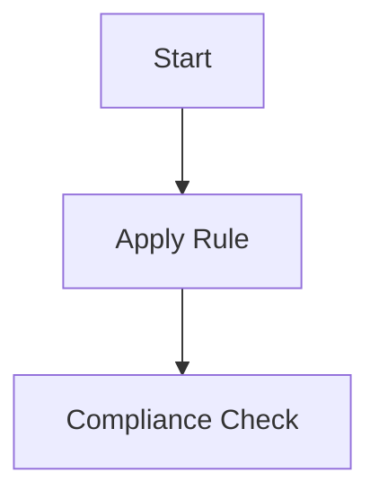

# {{title}} Rule

> [!IMPORTANT]
> Inserire principio cardine della regola. Questa regola è obbligatoria per tutti gli agenti AI.

## 🏗️ Architettura & Standard



## Esempio Pratico (TDD)

```typescript
// ✅ CORRETTO
function process(data: Data) { return true; }

// ❌ SBAGLIATO
function process(any: any) { return false; }
```

## Principio
Descrizione dettagliata...

## Step di Validazione
1. Verifica input
2. Applica trasformazione
3. Verifica output
