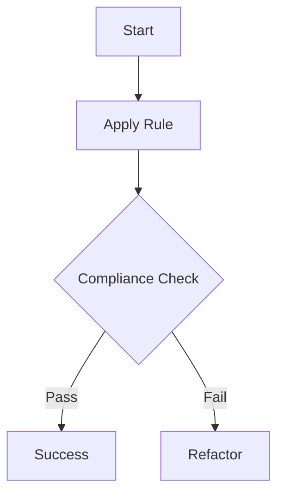

# {{title}} Rule

> [!IMPORTANT]
> Inserire principio cardine della regola. Questa regola è obbligatoria per tutti gli agenti AI.

## 🏗️ Architettura & Standard



## Esempi Pratici

### Codice (TDD Approach)
```typescript
// ✅ CORRETTO - Utilizzo di tipi espliciti
function process(data: Data): Result { 
    return { success: true }; 
}

// ❌ SBAGLIATO - Utilizzo di 'any'
function process(data: any): any { 
    return data; 
}
```

### Infrastruttura / Configurazione
```bash
# Esecuzione del controllo di conformità
npm run lint:rule
```

## Principio Dettagliato
Questa sezione deve spiegare i presupposti teorici e pratici della regola.
- **Vantaggi**: Riduzione della complessità, facilità di testing, manutenibilità a lungo termine.
- **Contesto**: Quando applicare questa regola e quando (se mai) è possibile derogare.
- **Integrità**: Come questa regola si relaziona con i principi SOLID e la Clean Architecture.
- **Riferimenti**: Collegamenti a documentazione esterna o altre regole interne.

## Step di Validazione & Verifica
1. Analisi statica del codice per identificare violazioni.
2. Esecuzione dei test unitari associati.
## Checklist di Conformità (Self-Check)
- [ ] Il file contiene YAML frontmatter completo.
- [ ] Sono presenti almeno 3 esempi di codice (corretto vs errato).
- [ ] Il diagramma Mermaid spiega chiaramente il flusso logico.
- [ ] È stato utilizzato almeno un Alert Tag per evidenziare punti critici.
- [ ] La lunghezza del file è tale da coprire tutti gli aspetti necessari (min. 60 righe).
- [ ] Naming convention kebab-case rispettata per il file.

## Domande Frequenti (FAQ)
- **Quando NON usare questa regola?** Se il progetto è un prototipo usa-e-getta senza necessità di manutenzione.
- **Come gestire i casi limite?** Documentare la deroga tramite un ADR specifico.
- **Chi deve validare la regola?** Lo script di validazione automatico e il Code Reviewer durante il PR.
- **Posso modificare questa regola?** Sì, tramite una proposta di refactoring che mantenga la retrocompatibilità.

## Riferimenti
- [.agents/rules/common.md](./common.md)
- [Antigravity Documentation Standards](../skills/documentation-standards/SKILL.md)

## Migliori Pratiche (Best Practices)
- **Modularità**: Dividi le regole complesse in sotto-regole più piccole e atomiche.
- **Rapporto Segnale/Rumore**: Mantieni gli esempi concisi ma completi.
- **Aggiornamento Proattivo**: Se una regola diventa obsoleta, segnalalo immediatamente.
- **Validazione Incrociata**: Verifica che la regola non entri in conflitto con altre regole esistenti.

## Conclusioni & Prossimi Passi
- [ ] Implementazione della regola nel progetto target.
- [ ] Monitoraggio dei risultati e feedback.
- [ ] Revisione periodica della validità della regola.

---
*v1.1 - Antigravity Standard Template*
