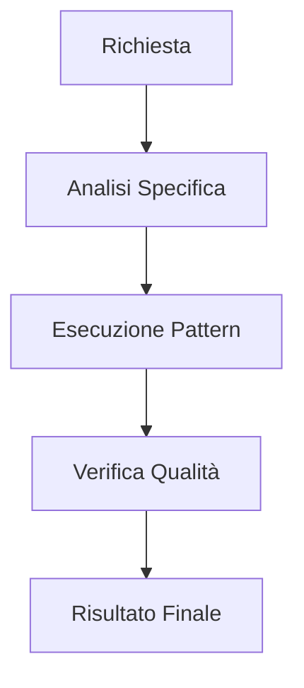

# {{title}} Skill

> [!TIP]
> Inserire suggerimento sull'uso della skill per massimizzare l'efficacia dell'AI.

## 🗺️ Workflow della Skill



## Prerequisiti & Dipendenze
- Conoscenza di base di {{title}}.
- Tool di sviluppo configurati.
- Accesso ai file di configurazione del progetto.

## Implementazione Pratica

### Esempio CLI
```bash
# Esempio di comando per attivare questa skill
npm run skill:{{title}} --option default
```

### Esempio Codice / Config
```javascript
// Esempio di pattern applicato
const pattern = {
    name: '{{title}}',
    enabled: true,
    rules: ['Clean Architecture', 'SOLID']
};
```

### Esempio Test
```typescript
// Validazione della skill tramite test
describe('{{title}} Skill', () => {
    it('should be compliant with standards', () => {
        expect(true).toBe(true);
    });
});
```

## Step Operativi Dettagliati
1. **Analisi del contesto**: Identificare dove la skill aggiunge maggior valore.
2. **Selezione del pattern**: Scegliere l'approccio più adatto tra quelli documentati.
3. **Esecuzione**: Applicare la skill seguendo le best practices.
4. **Validazione finale**: Verificare l'output tramite test o peer review.

## Error Handling & Troubleshooting
- **Problema A**: Soluzione...
- **Problema B**: Soluzione...

---
*v1.0 - Antigravity Skill System*
