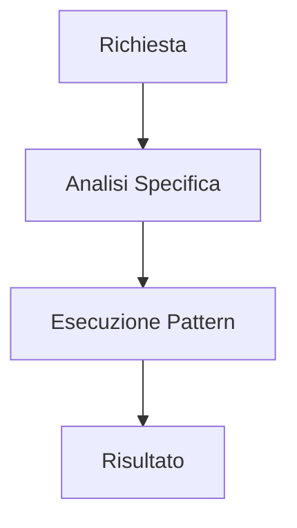

# {{title}} Skill

> [!TIP]
> Inserire suggerimento sull'uso della skill per massimizzare l'efficacia dell'AI.

## 🗺️ Workflow della Skill



## Obiettivo
...

## Implementazione (Example)

```bash
# Esempio di comando per attivare questa skill
node scripts/my-tool.js --param value
```

## Step Operativi
1. Analisi del contesto
2. Selezione del pattern
3. Validazione finale
